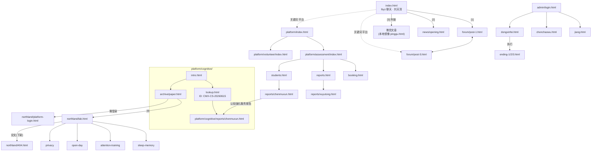

# 山经书店 · 消失的买家 —— 故事发展（全流程梳理）

> 依据当前仓库（`index.html` + `forum/` + `news/` + `pinggu.html` + `platform/` + `northland/` + `admin/`）逐页通读整理。
> 剧本原稿：`sjsd.md`。本文以**页面实际实现**为准，末尾附「当前架构问题/断链」。

---

## 〇、一句话概括

怀璧一中的学生 **刘天清** 在被迫转去「蒂中帝教育」封闭补习前，把调查任务交给玩家 **李令炉**：查清跑到怀璧的 **董新飞** 究竟在干什么。顺着论坛、新闻、公众号一路查下去，玩家发现那家生意火爆的 **山经书店** 以「学习能力评估」为幌子，用来自 **北境科技 · 安和实验室** 的技术**提取并出售学生的认知数据**。最终玩家潜入书店内部后台，在「测试/强力模式」与「清理记录/无痕模式」之间做出选择，决定 107 名学生与涉案人员的命运。

---

## 一、世界观与核心设定

| 项 | 内容 |
|----|------|
| 主舞台 | 怀璧市（县）· 山海街道 · **北城东路 173 号 · 山经书店**（一层教辅文具，二层「学习能力评估室」+ 地下层） |
| 相关机构 | 怀璧一中；羊村市 **蒂中帝教育**（封闭式、学生称「牢」）；**北境科技 · 安和实验室**（北境科技园区 C 座 4 层） |
| 核心技术 | 非侵入式**脑波采集** + 特定频率**音频同步**；把「源学生」的学科认知模式编码成刺激序列，注入目标个体，称为「**认知同步**」 |
| 副作用 | 源个体**能力衰退**（第1次 −7% / 第3次 −29% / 第6次 −61%）、**记忆碎片残留**（会想起不属于自己的画面）、生活记忆丢失 |
| 死线 | 技术论文建议：单次采集间隔 ≥72 小时、**单一个体不超过 3 次**；长期影响未知 |
| 商业本质 | 以「教辅书店 + 免费评估」为门面，把学生认知数据打包出售（数据包 ¥2999 等，已售上百套） |

---

## 二、人物表

**调查方**
- **李令炉**（玩家）：怀璧本地人，被刘天清拉来接手调查。
- **刘天清（ltq / 刘哥）**：怀璧一中学生，最初的调查者；被家长送去蒂中帝机构，留下**关键词自动回复脚本**后离开。

**山经方**
- **董新飞**：店长；42 岁，前狼堡技术员；化名「董鑫」，被学生叫「牢董」；动机是为儿子**建延**的留学费（80 万/年）。
- **姜游亮**：怀璧一中生物老师，与山经合作；后台「合作老师」账号。
- **陈超武**：原怀璧一中物理老师，辞职去蒂中帝，后台「高级操作员」。
- **舒巍 / 余皎颖**：从怀璧一中转到蒂中帝的老师（数学 / 英语），在后台上过操作记录。
- **程加春**：山经书店店员（开业新闻中唯一受访者）。

**安和实验室**（论文作者 / 技术来源）
- 主任 **张纬云**；副主任 **陈昱**、**乔维莉**（论文通信作者）；研究员 **赵筠**、**李芝梧**。

**学生（数据相关）**
- **徐雨桐**（生物，源数据 `XYT-20260220`，评级 A+，被反复抽取）、**陈牧循**（认知强化服务使用者）、**林晚**（686 分）、**赵思航**、**林婉仪**、**周晓雨**、**吴昊博**、**李杨梓麟**、**王宇涵**、**罗晋铭**。

**论坛/其他**：`周文江、穆品昆、姜游亮、徐今愿、马政敏、胡宏清`（勾结名单）；怀璧日报记者 **李怀瑾**。

---

## 三、主线流程（分幕）

### 幕 0 · 入口：lbyz 聊天（`index.html`）
- 玩家发去山经书店排队的照片（`assets/mx1.png`）+「你看看这个书店，有点nb啊」。
- 刘天清回应：董新飞可能跑到怀璧了，需要人调查；自己要进蒂中帝补习，**留了自动回复脚本**，并给出已查到的 **3 个网页 [1][2][3]**；随后离线的「回复小助手」只会对关键词作回应。
- 聊天支持**句中关键词匹配**（长词优先）：`牢董/董新飞`、`技术`、`受害者`、`小程序`、`认知强化`、`北境`、`平台`、`蒂中帝/老师`、`舒巍`、`余皎颖`、`陈超武`、暗号 `狼堡往事`。
- 触发「平台」类关键词会补发 **网页卡片 [4] 平台** 与 **[5] 论坛帖**；触发三位老师名字会补发**工位照片**（`assets/sw.png` / `yjy.png` / `ccw.png`）。

### 幕 1 · 三张网页（刘天清给的情报）
- **[1] `forum/post-1.html`**：蜜雪员工吐槽书店火爆 → 曝出「**HBYZ 和某书店勾结的老师名单**」：周文江、穆品昆、**姜游亮**、徐今愿、马政敏、胡宏清。
- **[2] `news/opening.html`**：怀璧日报开业报道（2026-05-26）——店长「董老师」拒访，店员**程加春**受访；二楼是「学习能力评估室」，招募志愿者送购物券。
- **[3] 公众号文章**：指向公众号「山经海籍」（`index.html` 中的 [3] 卡片目前为**外部微信链接**；其本地镜像为根目录 `pinggu.html`：林晚 686 分学霸访谈，埋了报告编号 `LW-20260415`、受试者 id `542122584`）。

### 幕 2 · 公众号「山经海籍」
- 自定义菜单：能力评估 / 书籍推荐 / 在线订书 / 新书上架 / 志愿者招募。
- 历史文章 [A]能力评估服务火热开放、[B]平台上线（**已删**）、[C]书籍推荐、[D]学习方法、[E]小程序上线、[F]新书上架、[G]志愿者第二轮招募（引用已删的 [B]）、[H]注入服务（**已删**）。
- 关键：平台网址**无法从公众号直接拿到**（承载它的文章被删），必须回 lbyz 向刘天清要。
- 关键词自动回复：`评估→[A]`、`平台→[B]`、`小程序→[E]`、`志愿者→[G]`、`注入→[H]`；**`合作`** → 跳转山经后台登录（进入第三幕的钥匙）。

### 幕 3 · 在线服务平台 [4]（`platform/index.html`）
- 平台首页 → **评估服务**（`platform/assessment/`）与**志愿者服务**（`platform/volunteer/`）。
- 评估服务：在线预约（`booking.html`，生成专属 ID，规则「姓名全拼首字母+名首字母+日期」，如 `CMX-MX-20260615`）→ 报告下载（`reports.html`，凭 ID 查询）→ 优秀学员（`students.html`，6 人：吴昊博/李杨梓麟/王宇涵/林晚/陈牧循/罗晋铭，各带报告）。
- 志愿者服务：招募说明（`activities.html`）、报名（`signup.html`，生成志愿者 ID）、奖励领取（`reward.html`，内置 **刘天清** 的 `LTQ-TQ-20260314`，已参与 3 次）。
- **核心谜题入口**：优秀学员里**陈牧循的第二次评估报告**（`reports/chenmuxun.html`）脚注写着「该生曾接受过一次**认知强化服务**」，并给出指向 `platform/cognitive/reports/chenmuxun.html` 的链接。

### 幕 4 · 认知强化服务 [6]（`platform/cognitive/`）
- `intro.html`：服务介绍——把源学生认知模式编码成音频，3–5 倍学习效果；明确技术来自论文《记忆提取和注入操作的可行性探究》，并留了论文存档链接 [7]。
- `lookup.html`：输入**个人 ID `CMX-CS-20260615`** 查询 → 命中陈牧循的服务记录。
- `reports/chenmuxun.html`：服务报告。**源数据编号 `XYT-20260220`（生物 · A+）**、同步完成度 87%、提升 +23%；备注点明「源数据提取自**徐雨桐**，**已售出 17 次**，建议单一个体不超过 3 次，长期影响未知」。
- `archive/paper.html`：[7] 论文留档（存档编号 `NL-ANHE-2025-0713`），作者 陈昱 / 张纬云 / **乔维莉**，单位「北境科技安和实验室」，含提取次数与源个体衰退数据表、「实时前端平台」章节。页面外链指向 **实验室官网 [8]** 与「远程前端平台（需登录）」。

### 幕 5 · 安和实验室 [8]（`northland/`）
- `lab.html`：官网（成立 2024，固定时钟 2025-10-24）。成果展示 5 条；人员介绍（张纬云/陈昱/乔维莉/赵筠/李芝梧）；研究平台入口。
  - 成果 1–4 分别进入 `sleep-memory.html`、`attention-training.html`、`open-day.html`、`privacy.html`（均为「合规/洗白」文稿）。
  - 成果 5（论文《记忆提取和注入操作的可行性探究》）**点进去是 `404.html`**（论文被下架）。
- `platform-login.html`：内部技术支持网页（复古 Win9x 风）。**「系统登录已关闭」**，任何账号都无法登录；页面暴露**旧默认密码 `BeiJg12z`**（纯线索）。

### 幕 6 · 山经书店内部后台 [9][10][11]（`admin/`）
入口：公众号发送 `合作` → `admin/login.html`（「北境科技·安和实验室 内部后台」，账号为**姓名全拼音小写**，密码**区分大小写**）。

| 账号 | 用户名 | 密码 | 角色 | 能看到 |
|---|---|---|---|---|
| 姜游亮 | `jiangyoulian` | `BeiJg12z`（未改的默认密码） | 合作老师 | 评估记录；志愿者库/认知强化/远程操作 **权限不足**；个人报告（吐槽 dxf 在干怪事） |
| 陈超武 | `chenchaowu` | `37842516`（书桌顺序） | 高级操作员 | 志愿者能力抽取数据库、匹配工具、**当前项目：山经-蒂中帝联合提取项目（107 人，倒计时 1:12:00）**、认知强化申请列表 |
| 董新飞 | `dongxinfei` | `fhuehwuiaa` | 店长/管理员 | 全部权限：远程操作 + 三个开关 + 系统日志清理 + 日记 |

- **刘天清的报告**里有额外「记忆抹除内容」：`牟通雪`、`董新飞`、`fhuehwuiaa`（即店长账号密码）。
- 三个账号页都支持：**操作日志**（记录本人操作）、**无痕模式（隐私浏览）**开关（开启后停止一切日志记录）。

### 幕 7 · 董新飞的决策与三结局（`admin/dongxinfei.html`）
董新飞页的三个「开关」（默认值全部指向坏结局）：
1. **运行模式**（远程操作下拉）：`strong` 强力模式（默认）/ `test` 测试模式。
2. **清理日志记录**（藏在「系统日志」的小字链接里）：`correct` 仅清理本项目痕迹 / `incorrect` 清理全部历史 / `none` 暂不清理（默认）。
3. **无痕模式**（藏在页脚「隐私浏览」）：`off`（默认）/ `on`。

点「执行远程操作」后按组合路由：

| 组合 | 结局 |
|---|---|
| `strong` + `correct` + `on` | `ending-2.html` 无法复原（坏） |
| `test` + `correct` + `on` | `ending-3.html` 及时收网（好） |
| 其余任意组合 | `ending-1.html` 数据蒸发（坏） |

- **结局一 · 数据蒸发**：未清理/清理不当或未开无痕。107 人被抽取，董新飞察觉败露把数据转走；董、陈被抓，但数据丢失无法复原；很多人（徐雨桐、赵思航、林婉仪…）再也回不来，**刘天清数学变普通且失去大量记忆**。
- **结局二 · 无法复原**：强力模式 + 正确清理 + 无痕。107 人被**超额抽取**、损伤不可逆，现有技术无法复原——「你把这些人坑了」。
- **结局三 · 及时收网**：测试模式 + 正确清理 + 无痕。无人被抽取；董新飞未察觉；董、陈被抓，并抓到安和实验室的 **乔维莉**，其余人逃往国外——好结局。

---

## 四、关键编号 / 密码 / 暗号 速查

**ID 体系（同一正则 `^[A-Za-z]{2,4}-[A-Za-z]{2,4}-\d{6,8}$`）**
| 类型 | 示例 | 含义 |
|---|---|---|
| 评估 ID | `CMX-MX-20260615` | 陈牧循 · 预约生成 |
| 认知强化服务 ID | `CMX-CS-20260615` | 陈牧循 · 服务记录（**可查**） |
| 源数据编号 | `XYT-20260220` | 徐雨桐 · 生物 A+ |
| 志愿者 ID | `LTQ-TQ-20260314` | 刘天清 · 参与 3 次 |
| 论文存档编号 | `NL-ANHE-2025-0713` | 安和实验室内部资料 |
| 报告编号 | `LW-20260415-01` / `WHB-20260530-01` … | 各学员评估报告 |
| 受试者 id | `542122584` | 林晚访谈页脚 |

**密码 / 暗号**
| 项 | 值 |
|---|---|
| 后台默认密码（姜游亮账号） | `BeiJg12z` |
| 陈超武密码 | `37842516`（书桌顺序） |
| 董新飞密码 | `fhuehwuiaa`（＝刘天清被抹记忆内容之一） |
| 安和研究平台旧默认密码 | `BeiJg12z`（登录已关闭，仅线索） |
| 舒巍线索 | 「输密码时念叨 **13 的 8 次方**」 |
| lbyz 暗号 | `狼堡往事`（触发刘天清人工回复） |
| 公众号关键词 | `评估 / 平台 / 小程序 / 志愿者 / 注入 / 合作` |

---

## 五、页面地图（跳转关系）

> 注意：`admin/` 的入口来自**微信端公众号关键词「合作」**（网页内暂无入链）。

---

## 六、玩家推理路径要点

1. 论坛 [1] 拿到「勾结老师名单」→ 记住 **姜游亮**。
2. 论坛 [5] 得知存在「**评估之外**的隐藏服务」，入口在**某个人的评估报告**里，且要**输服务 ID**。
3. lbyz 关键词「平台」→ 拿到平台 [4]，并被提示平台里藏着服务。
4. 平台优秀学员 → **陈牧循第二次报告** → 认知强化服务 → 服务 ID `CMX-CS-20260615` → 服务报告揭露**源数据 = 徐雨桐**（数据买卖闭环）。
5. 认知强化介绍 → 论文 [7] → 实验室 [8]（论文 404）→ 研究平台登录（已关闭，`BeiJg12z` 线索）。
6. lbyz 问「蒂中帝老师」→ 得到 舒巍 / 余皎颖 / 陈超武 的工位照与线索（`13的8次方`、书桌顺序、记忆差）。
7. lbyz 问「认知强化」→ 提示去公众号发「**合作**」→ 进入内部后台。
8. 后台三账号依次揭底：姜游亮（权限不足 + 吐槽）→ 陈超武（107 人联合项目、刘天清被抹记忆）→ 董新飞（开三开关、执行）。
9. 慎选「测试模式 + 正确清理 + 无痕」→ 好结局；否则坏结局。

---

## 七、当前架构问题 / 断链（建议修复）

> 以下为通读后发现的实现问题，**未擅自改动**，供你决策。

1. **登录用户名拼写不一致**：`admin/login.html` 的账号键是 `jiangyouliang`，但 `admin/jiang.html` 顶栏、日志、`ME` 全部是 `jiangyoulian`。按剧本「姓名全拼小写」应为 **`jiangyoulian`**。
2. **`index.html` 缺少关键词条目**：`findKeyword()` 会返回 `'蒂中帝老师'`、代码也会用到 `keywordResponses['帮助']` 与 `['退出']`，但对象里**没有**这三个键（且 `'老师'` 键重复了一次）→ 触发组合词/「帮助」/「退出」时会显示 `undefined`。
3. **通往实验室的链条断裂（关键）**：`platform/cognitive/intro.html`、`lookup.html`、`archive/paper.html` **没有任何外部入链**；唯一进入认知强化目录的是 `reports/chenmuxun.html → cognitive/reports/chenmuxun.html`，而**该服务报告页不链回 `intro.html`/`archive/paper.html`**。因此玩家无法走到论文 [7]、实验室 [8]——整条后半段剧情与 `northland/*` 目前均为「孤岛」。（建议在 `cognitive/reports/chenmuxun.html` 增加返回 `../intro.html`、`../archive/paper.html` 的链接，或在报告脚注直接给论文入口。）
4. **优秀学员标签与报告正文矛盾**：`students.html` 标「第 N 次 / 年级」与报告内「第 1 次 / 年级」不符（如王宇涵标高二第 2 次、报告写高一的第 1 次）。若为「对外包装 vs 真实数据」的有意设计可保留，否则需统一。
5. **时间悖论**：林晚 2026-04-15 的「第 1 次」报告写入了**高考成绩**；徐雨桐 2026-02-08 的报告**引用 2026-02-20 的采集**（晚于报告）。
6. **「区分大小写」提示与实现不符**：`cognitive/lookup.html`、`volunteer/reward.html` 提示「请注意区分大小写」，但代码用 `.toUpperCase()`（实际大小写不敏感）。
7. **[3] 外链与本地镜像**：`index.html` 的 [3] 指向外部 `mp.weixin.qq.com/...`，而本地镜像 `pinggu.html` 目前**无任何入链**（且顶部返回指向 `index.html`）。
8. **表单双重处理**：`booking.html`、`volunteer/signup.html` 的 `<form data-demo>` 会被 `site.js` 与页面内联脚本**同时接管**，可能出现提示覆盖 / 提前禁用控件。
9. **徐雨桐报告无实名入口**：`reports/xuyutong.html` 不在优秀学员名录，只能靠 `reports.html` 输入 `XYT-YT-20260208` 到达——符合「数据源被隐藏」的设计，但需确认玩家能拿到这个查询 ID。

---

## 八、结局回显与存档键（开发参考）

| localStorage 键 | 取值 | 用途 |
|---|---|---|
| `sjsd_remote_mode` | `strong`(默认)/`test` | 运行模式，决定强力/测试 |
| `sjsd_wipe_records` | `none`(默认)/`correct`/`incorrect` | 日志清理选择 |
| `sjsd_ghost_mode` | `off`(默认)/`on` | 无痕模式，开启后停写日志 |
| `sjsd_admin_log` | `[{ts,user,text}]` | 玩家操作日志（按账号过滤回显） |
| `lbyz_chat_history_v2` | 消息数组 | lbyz 聊天记录持久化 |
| `shanjing_booking` | 预约数组 | 评估预约写入 |
| `shanjing_volunteer` | 报名数组 | 志愿者报名写入 |

**结局页**（`admin/ending-1/2/3.html`）会回显三项配置，并提供「重新体验」（清除前三个键 → 回 `dongxinfei.html`）。
